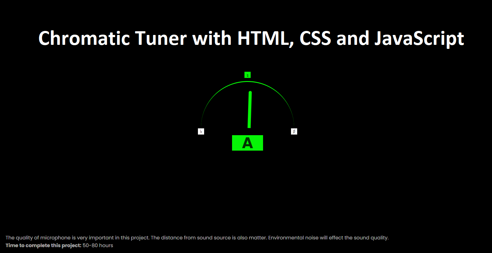

## JavaScript Chromatic Tuner Machine 

This is a Chromatic Tuning Machine which will detect all your musical notes between A2-A7 ranges. We use 440Hz frequency which is a gold standard frequency to tune any instruments. 

I don't use any library, however, I got help from "Pitch Detect" by Chris Wilson. He 
made me to complete this project. Some of the partial codes are directly inherited from 
"Pitch Detect" and "Web Audio" course from Future Learn. I recommend you to look at "Pitch Detect". 

The project is very fun to work with a lot challenges. It will take you around 50-80 hours. 

### How to run
<ol>
    <li>Open "index.html" on browser</li>
</ol>

#### GULP using Terminal
By using Gulp, you will need "NodeJS" and "Gulp" library install. In my gulp tasks, it will compile SCSS to CSS, TypeScript to JavaScript and your browser will load automatically when you make changes on HTML, SCSS, CSS, JavaScript and TypeScript. Browser will load automatically when you save the files. 

You may use Gulp and TypeScript configuration to your project. 
<ol>
<li>$ npm install </li>
<li>$ gulp</li>
</ol>

## YouTube Video Demo: https://youtu.be/QUrcBLPKKTM

Ref Sites: 
"Pitch Detect" Source Code: https://github.com/cwilso/PitchDetect
 
Physics of Music Notes: https://pages.mtu.edu/~suits/Physicsofmusic.html
 
Code examples that accompany the MDN Web Audio documentation https://developer.mozilla.org/en-US/docs/Web/API/Web_Audio_API

